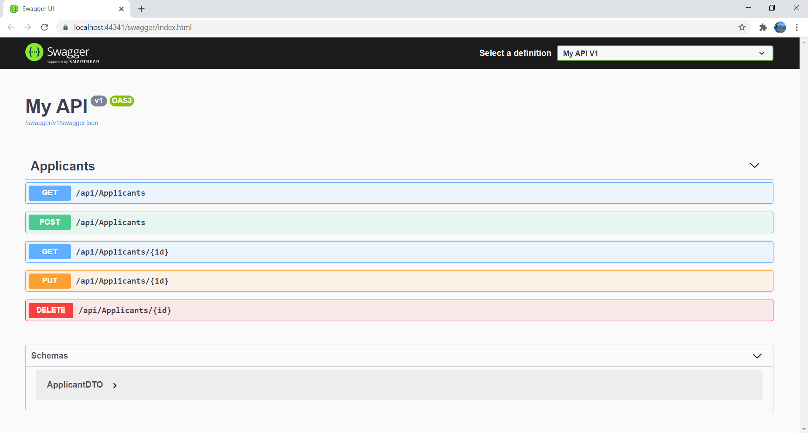

# Hahn.ApplicatonProcess.Application
This is a simple Dot net core Web Api project that performs some CRUD operations
# Pre-requisites
.net 5.0 SDK  
Visual Studio 2019 
# Running the project
After installing the pre-requisites, clone or download this project, open with visual studio, do "dotnet restore" , run the solution. Here's a preview -  

